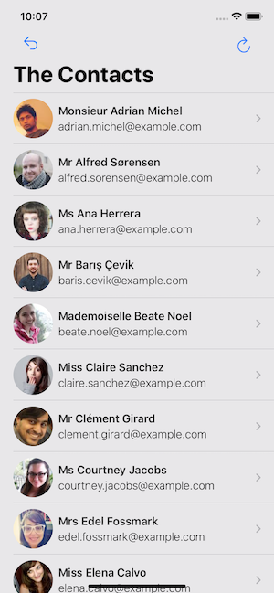
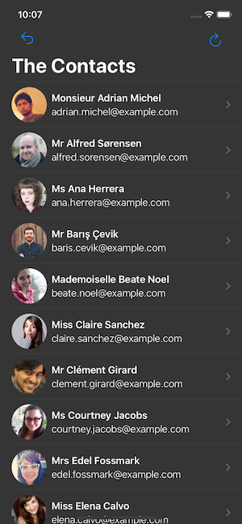
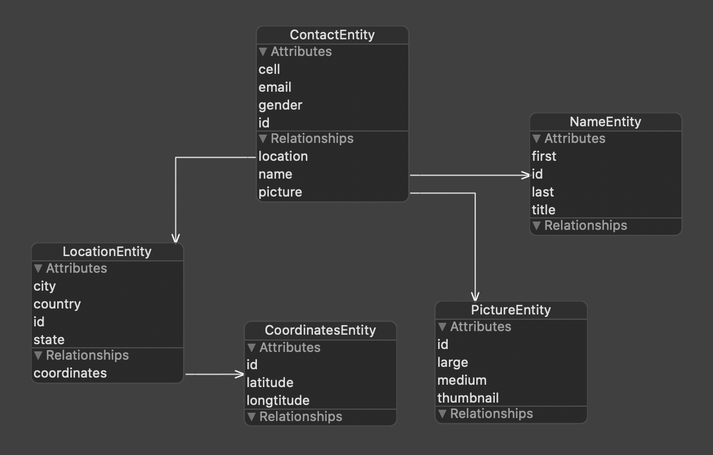

# IOSDemo

+ Swift 5
+ MVVM Architecture Pattern
+ SwiftUI
+ Combine framework
+ Animation
+ Singleton
+ API service with URLSession
+ Core Data
+ Error Handler
+ Protocol
+ Extension
+ Generic
+ UserDefaults
+ Internationalization and localization
+ Supporting Dark Mode
+ Custom Fonts
+ Swift Package
+ NotificationCenter
+ Unit Testing example
+ UI Testing example

## Video

## Screenshots
 

## Core Data

